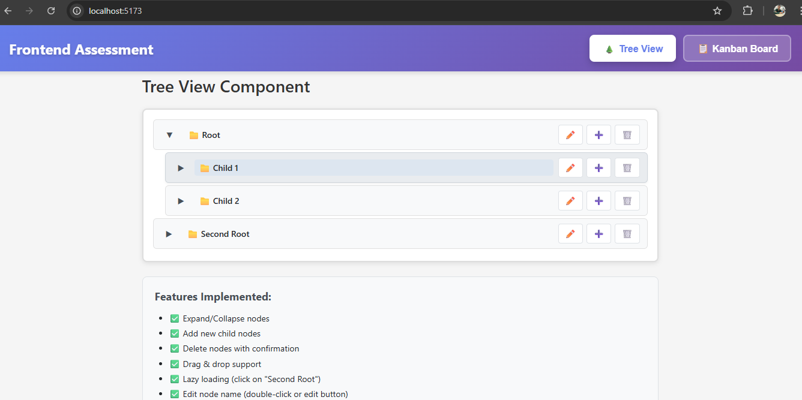
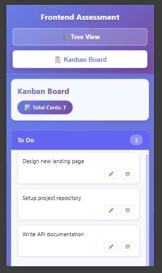

# Frontend Developer Assessment

A comprehensive React + TypeScript project implementing two interactive components: a Tree View and a Kanban Board.

## 🔗 Links

- **Live Demo:** [Add your deployed URL here]
- **Repository:** [Add your GitHub repository URL here]

## 📋 Table of Contents

- [Overview](#overview)
- [Features](#features)
- [Tech Stack](#tech-stack)
- [Project Structure](#project-structure)
- [Installation](#installation)
- [Usage](#usage)
- [Components](#components)
- [Screenshots](#screenshots)
- [Development](#development)
- [Deployment](#deployment)
- [License](#license)

## 🎯 Overview

This project is a solution to a Frontend Developer Assessment containing two practical questions:

1. **Tree View Component** - A fully functional hierarchical tree structure with drag & drop, lazy loading, and CRUD operations
2. **Kanban Board Component** - A task management board with three columns and drag & drop functionality

## ✨ Features

### Question 1: Tree View Component

- ✅ **Expand/Collapse Nodes** - Toggle node visibility with animated arrows
- ✅ **Add Child Nodes** - Create new nodes with inline input form
- ✅ **Delete Nodes** - Remove nodes with confirmation dialog (including subtrees)
- ✅ **Drag & Drop** - Reorder and move nodes across the hierarchy
- ✅ **Lazy Loading** - Simulate async API calls when expanding nodes
- ✅ **Inline Editing** - Double-click or click edit button to rename nodes
- ✅ **Keyboard Shortcuts** - Enter to save, Escape to cancel
- ✅ **Visual Feedback** - Loading indicators and hover states

### Question 2: Kanban Board Component

- ✅ **Three Columns** - To Do, In Progress, and Done
- ✅ **Add Cards** - Create new task cards in any column
- ✅ **Delete Cards** - Remove cards with confirmation
- ✅ **Drag & Drop** - Move cards between columns seamlessly
- ✅ **Inline Editing** - Edit card titles on the fly
- ✅ **Responsive Design** - Mobile-friendly layout that stacks vertically
- ✅ **Card Ordering** - Maintains order within each column
- ✅ **Visual Indicators** - Card counts, empty states, and drag feedback
- ✅ **Modern UI** - Gradient backgrounds and smooth animations

## 🛠️ Tech Stack

- **React 18+** - UI library
- **TypeScript** - Type safety and better developer experience
- **Vite** - Fast build tool and dev server
- **CSS3** - Modern styling with gradients and animations
- **HTML5 Drag & Drop API** - Native drag and drop functionality
- **React Hooks** - useState, useRef, useEffect for state management

## 📁 Project Structure

```
frontend-assessment/
├── public/
├── src/
│   ├── components/
│   │   ├── TreeView/
│   │   │   ├── TreeView.tsx       # Main tree component
│   │   │   ├── TreeNode.tsx       # Individual node component
│   │   │   └── TreeView.css       # Tree styling
│   │   └── Kanban/
│   │       ├── KanbanBoard.tsx    # Main board component
│   │       ├── Column.tsx         # Column component
│   │       ├── Card.tsx           # Card component
│   │       └── Kanban.css         # Kanban styling
│   ├── types/
│   │   ├── tree.ts                # Tree type definitions
│   │   └── kanban.ts              # Kanban type definitions
│   ├── utils/
│   │   ├── treeHelpers.ts         # Tree utility functions
│   │   └── kanbanHelpers.ts       # Kanban utility functions
│   ├── App.tsx                    # Main app with navigation
│   ├── App.css                    # Global styles
│   └── main.tsx                   # Entry point
├── package.json
├── tsconfig.json
├── vite.config.ts
└── README.md
```

## 🚀 Installation

### Prerequisites

- Node.js (v16 or higher)
- npm or yarn

### Steps

1. **Clone the repository**
   ```bash
   git clone [your-repo-url]
   cd frontend-assessment
   ```

2. **Install dependencies**
   ```bash
   npm install
   ```

3. **Start development server**
   ```bash
   npm run dev
   ```

4. **Open in browser**
   ```
   http://localhost:5173
   ```

## 💻 Usage

### Tree View

1. **Expand/Collapse**: Click the arrow icon (▶/▼) next to any node
2. **Add Child**: Click the ➕ button, enter a name, and press Enter or click "Add"
3. **Edit Node**: Double-click on node name or click the ✏️ button
4. **Delete Node**: Click the 🗑️ button and confirm deletion
5. **Drag & Drop**: Drag any node and drop it onto another node to move it
6. **Lazy Load**: Click on "Second Root" to see lazy loading in action

### Kanban Board

1. **Add Card**: Click "+ Add Card" button at the bottom of any column
2. **Edit Card**: Double-click on a card or click the ✏️ button
3. **Delete Card**: Click the 🗑️ button on a card
4. **Move Card**: Drag a card from one column and drop it in another
5. **Switch Views**: Use the navigation buttons at the top to switch between Tree View and Kanban Board

## 🧩 Components

### Tree View Architecture

```typescript
TreeView (Main Component)
  └── TreeNode (Recursive Component)
      ├── Expand/Collapse Button
      ├── Node Name (Editable)
      ├── Action Buttons (Edit, Add, Delete)
      ├── Add Node Form (Conditional)
      └── Children Nodes (Recursive)
```

### Kanban Board Architecture

```typescript
KanbanBoard (Main Component)
  └── Column (3 instances)
      ├── Column Header
      ├── Card List
      │   └── Card (Multiple instances)
      │       ├── Card Content
      │       └── Action Buttons
      └── Add Card Button
```

## 📸 Screenshots

### Tree View Component

*Hierarchical tree structure with expand/collapse functionality*

### Kanban Board Component

*Task management board with drag & drop*

### Responsive Mobile View

*Responsive design adapts to mobile screens*

> **Note:** Add actual screenshots to a `/screenshots` folder in your project

## 🔧 Development

### Available Scripts

```bash
# Start development server
npm run dev

# Build for production
npm run build

# Preview production build
npm run preview

# Lint code
npm run lint

# Type check
npm run type-check
```

### Code Quality

- **TypeScript** - Full type coverage with strict mode enabled
- **Component Structure** - Clean separation of concerns
- **Reusability** - Modular, reusable components
- **Performance** - Optimized renders and state updates
- **Accessibility** - Semantic HTML and ARIA labels

### Key Design Decisions

1. **No External Libraries** - Minimal dependencies except React and TypeScript
2. **Native Drag & Drop** - Using HTML5 Drag & Drop API for better performance
3. **Component Decomposition** - Separated logic into reusable components
4. **Helper Classes** - Utility functions for tree and kanban operations
5. **CSS Modules** - Scoped styling to prevent conflicts

## 🌐 Deployment

### Vercel (Recommended)

```bash
# Install Vercel CLI
npm install -g vercel

# Deploy
vercel
```

### Netlify

```bash
# Build the project
npm run build

# Drag and drop the 'dist' folder to Netlify dashboard
# Or use Netlify CLI
npm install -g netlify-cli
netlify deploy --prod
```

### GitHub Pages

```bash
# Install gh-pages
npm install gh-pages --save-dev

# Add to package.json scripts:
# "predeploy": "npm run build",
# "deploy": "gh-pages -d dist"

# Deploy
npm run deploy
```

## 📝 Assessment Requirements

### Question 1 - Tree View ✅

- [x] Expand/Collapse Nodes
- [x] Add New Node
- [x] Remove Node
- [x] Drag & Drop Support
- [x] Lazy Loading
- [x] Edit Node Name
- [x] React + TypeScript
- [x] Clean State Management
- [x] Component Decomposition
- [x] Minimal External Libraries

### Question 2 - Kanban Board ✅

- [x] Three Columns (Todo, In Progress, Done)
- [x] Add/Delete Cards
- [x] Move Cards Between Columns
- [x] Editable Card Title
- [x] Responsive Layout
- [x] React + TypeScript
- [x] Clean State Management
- [x] Drag-and-Drop Implementation
- [x] Proper Component Structure

## 🤝 Contributing

This is an assessment project, but feedback is welcome!

1. Fork the repository
2. Create a feature branch (`git checkout -b feature/improvement`)
3. Commit your changes (`git commit -am 'Add new feature'`)
4. Push to the branch (`git push origin feature/improvement`)
5. Create a Pull Request

## 📄 License

This project is created for assessment purposes. Feel free to use it as a reference.

## 👨‍💻 Author

**[Your Name]**
- GitHub: [@BalramApply](https://github.com/BalramApply)
- LinkedIn: [Balram Patel](https://linkedin.com/in/https://www.linkedin.com/in/balram-patel-185aa526a/)
- Email: balramapply123@gmail.com

## 🙏 Acknowledgments

- Assessment provided by [Company Name]
- Built with React and TypeScript
- Icons: Unicode emoji characters
- Gradient inspiration from modern web design trends

---

**Last Updated:** January 2026

**Status:** ✅ Complete and Ready for Review

**Note:** This project demonstrates proficiency in React, TypeScript, component architecture, state management, and modern web development practices.